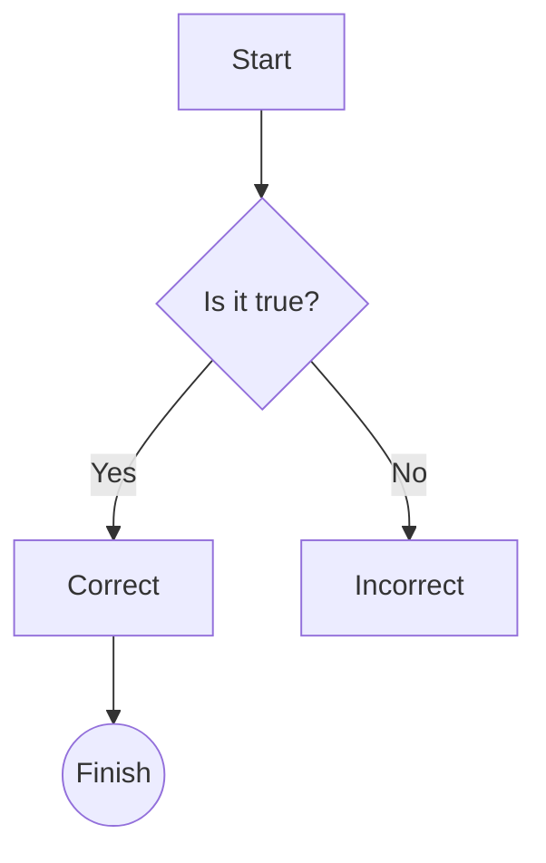
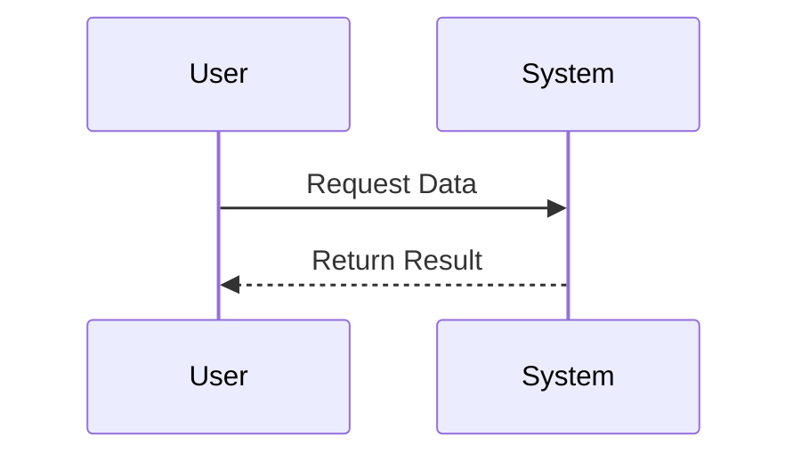
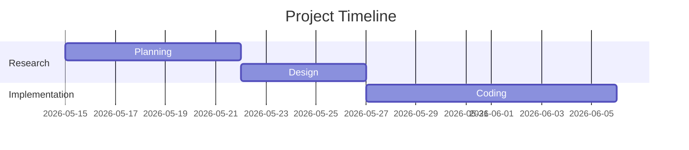

# BYU-Idaho Slides

This repository provides a custom Marp theme and template for creating presentations that match the BYU-Idaho brand.

## Features
- **Multi-Deck Support:** Organizes multiple slide decks in a `slides/` directory.
- **Custom BYUI Theme:** matches official brand colors and includes a footer logo.
- **Automated Build:** Fast build script for HTML and PDF outputs.
- **Clean Output:** Compiled slides are placed in a `dist/` folder.

## Getting Started

### 1. Install Marp CLI
You can install Marp CLI locally in this project:

```bash
npm install
```

This will install the required dependencies (including `@marp-team/marp-cli`) as defined in `package.json`.

*Note: If you are using Node.js v25+, there is a known compatibility issue with `yargs`. This project includes a local fix in `node_modules/yargs/package.json` to ensure the build script works.*

### 2. PDF Support
Generating PDF slides requires a browser (Chrome, Chromium, Edge, or Firefox) to be installed on your system. If a browser is not found, only HTML output will be generated.

### 3. Project Structure
- `slides/`: Place your `.md` slide decks here.
- `assets/`: Images, logos, and backgrounds used in slides.
- `dist/`: Where your compiled HTML/PDF files will appear.
- `build/`: Intermediate preprocessed files (useful for debugging).
- `theme.css`: The shared BYUI theme.

### 4. Advanced Features (Preprocessing)

This project includes a preprocessing step that adds powerful capabilities to your Markdown slides:

#### File Inclusion
You can pull content from one `.md` file into another using the `[$filename.md$]` syntax. This is perfect for shared slides like "Questions?" or "Conclusion."
- Place shared files in the `common/` directory.
- Use `[$questions.md$]` to insert the content of `common/questions.md`.

#### Mermaid Diagrams
The build script automatically detects Mermaid code blocks, renders them to PNG images, and includes them in your final slides.

## Diagrams

The project supports [Mermaid](https://mermaid.js.org/) for creating diagrams directly in Markdown. Here are the most common patterns you'll use:

### Flowcharts
Use `graph TD` (Top-Down) or `graph LR` (Left-Right).



*   `[Square]` = Rectangular node
*   `{Diamond}` = Decision node
*   `((Circle))` = Goal/Event node
*   `-->` = Simple arrow
*   `-- Text -->` = Arrow with label

### Sequence Diagrams
Perfect for showing interactions between components.



### Gantt Charts
Useful for project timelines.



### 5. Build Your Slides
Use the provided `build.sh` script to build one or all decks:

```bash
# Build ALL slides in slides/ to the dist/ folder as HTML
./build.sh

# Build ALL slides as PDF
./build.sh --pdf

# Build a SPECIFIC slide deck
./build.sh example.md
./build.sh --pdf example.md
```

### 6. Serve Your Slides
To view your slides locally (required for YouTube videos to work correctly), use the `serve.sh` script:

```bash
# Start a local server at http://localhost:8080
./serve.sh

# Start on a custom port
./serve.sh 9000
```

This will serve the `dist/` directory and open an `index.html` file listing all your compiled slide decks.

---

## Marp Markdown Crash Course

Marp uses standard Markdown with a few extra features.

### Slide Separators
Use `---` on a line by itself to create a new slide.

### Directives
Directives control the behavior of the slide deck. Place them at the top of your `.md` file:

```markdown
---
marp: true
theme: byui
paginate: true
---
```

Use `<!-- _class: title -->` to apply a layout class to a single slide.

### Asset Paths
Since slides are in the `slides/` folder, reference images in the `assets/` folder using `../assets/`:

```markdown

```

---

## Repository Structure
- `slides/`: Markdown content.
- `common/`: Reusable slide components.
- `theme.css`: Custom BYUI styles.
- `assets/`: Shared image assets.
- `dist/`: Generated output (ignored by git).
- `build.sh`: Orchestration script.
- `preprocess.py`: Preprocessing engine (inclusions, mermaid).

