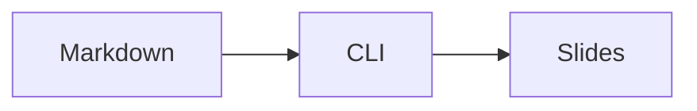

# BYUI Slides CLI

`byui-slides` is a CLI for creating, building, and serving BYU-Idaho-branded Marp slide decks.

## Install

```bash
npm install
```

For local development, run the CLI with Node:

```bash
node ./bin/byui-slides.js --help
```

After publishing or linking the package, use:

```bash
byui-slides --help
```

## Commands

### `init`

Create a starter slide project in the current directory:

```bash
byui-slides init
```

Or scaffold into another folder:

```bash
byui-slides init my-course-slides
```

This copies:

- `slides/`
- `common/`
- `assets/`

Use `--force` to overwrite existing starter folders.

### `build`

Build every deck in `slides/` to HTML:

```bash
byui-slides build
```

Build a single deck:

```bash
byui-slides build example.md
```

Build PDFs instead:

```bash
byui-slides build --pdf
byui-slides build example.md --pdf
```

The build command:

- preprocesses `!!!include(...)!!!` directives
- renders Mermaid blocks to PNG assets
- writes intermediate files to `build/`
- writes compiled output to `dist/`
- regenerates `dist/index.html`

### `serve`

Serve the generated `dist/` folder locally:

```bash
byui-slides serve
byui-slides serve 9000
```

## Project Layout

After `init`, a slide project looks like this:

```text
assets/
common/
slides/
build/   # generated
dist/    # generated
```

## Writing Slides

### Marp front matter

Every deck needs Marp front matter:

```markdown
---
marp: true
theme: byui
paginate: true
---
```

### Slide separators

Use `---` on its own line to create a new slide.

### BYUI layout classes

Apply a class to the current slide with an HTML comment:

```markdown
<!-- _class: title -->
```

Available starter layouts include:

- `title`
- `section-header`

### Shared slides

Reuse slides from `common/` with:

```markdown
!!!include(questions.md)!!!
```

### Assets

Reference project assets from decks in `slides/` with `../assets/...`:

```markdown

```

The preprocessor rewrites these paths for compiled output automatically.

### Mermaid

Mermaid code fences are rendered during build:

````markdown

```mermaid
graph LR
  A[Markdown] --> B[CLI]
  B --> C[Slides]
```
````

## Notes

- PDF builds require a browser supported by Marp CLI.
- `build.sh` and `serve.sh` remain as thin wrappers around the CLI.
- Tests run with:

```bash
npm test
```
